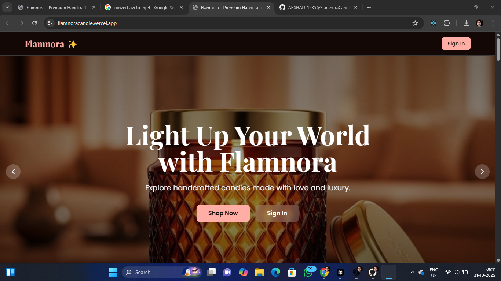
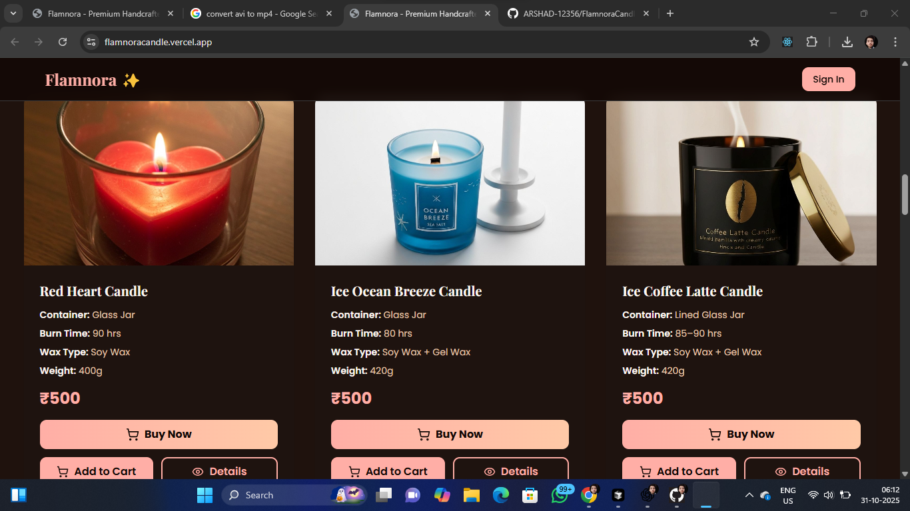
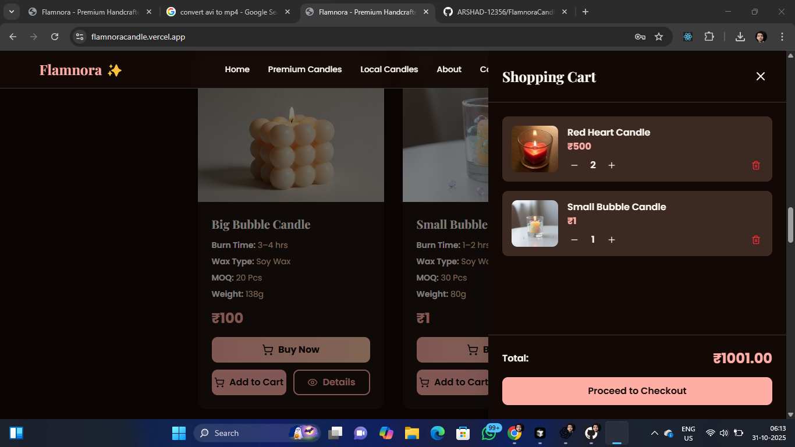
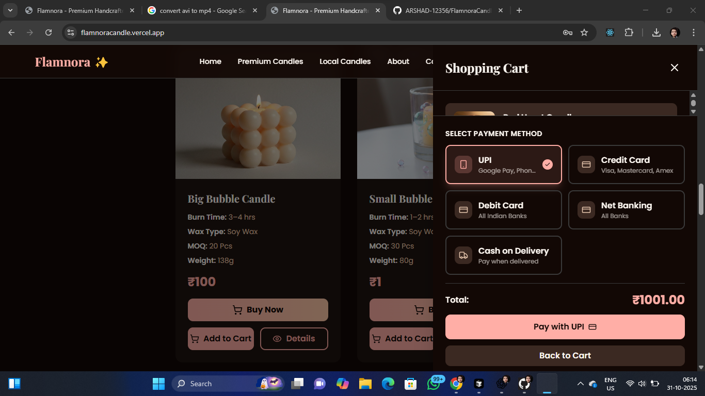
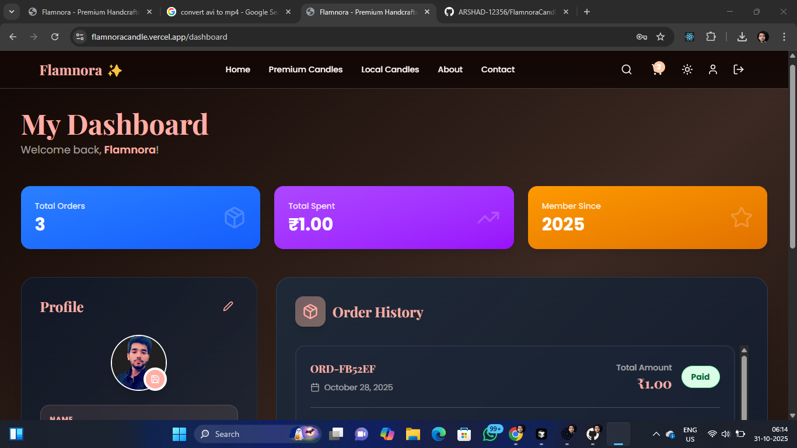

## 🖼️ Project Screenshots
Here’s a preview of the live website 👇  

  
  
  
  
  
  

🕯️ Project Overview

Flamnora is a full-stack e-commerce website designed for selling premium handcrafted candles.
It delivers a smooth shopping experience with secure authentication, real-time product updates, and Razorpay-powered payments.
The project is now fully production-ready and live on Vercel.

🌐 Live Links

Frontend: https://flamnoracandle.vercel.app

Backend: Hosted on Render
Database: MongoDB Atlas

✨ Key Features

🧠 User Authentication – Secure sign-up, login, and logout using JWT

🛍️ Product Catalog – Explore multiple candle collections with filters

🛒 Cart Management – Add, remove, and update products in real-time

💳 Payment Gateway – Razorpay integration for secure online payments

📦 Order Tracking – Stores user order details, payment status, and products in MongoDB

🔍 Search Bar – Instant product search functionality

🌓 Dark Mode – Smooth and elegant theme toggle

📱 Responsive UI – Optimized for both mobile and desktop users

🚀 Deployed – Production-ready and running live on Vercel

🛠️ Tech Stack

Frontend: Next.js, React, Tailwind CSS, TypeScript
Backend: Node.js, Express.js, MongoDB (Mongoose)
Payment Gateway: Razorpay Integration
Hosting:

Frontend → Vercel

Backend → Render

Database → MongoDB Atlas

🧠 How to Run Locally

Clone the repository
git clone https://github.com/your-username/flamnora.git

Navigate to project folder
cd flamnora

Install dependencies
npm install

Start the development server
npm run dev

👨‍💻 Developer

Md Arshad Raza
🎓 Full Stack Developer | MERN & Next.js Enthusiast
📧 flamnoracandles456@gmail.com

💼 LinkedIn Profile

🏁 Project Status

✅ Flamnora is fully production-ready and live!
🔒 Razorpay verified and MongoDB data handling active.
🛒 Real-time orders and user dashboard implemented successfully.

